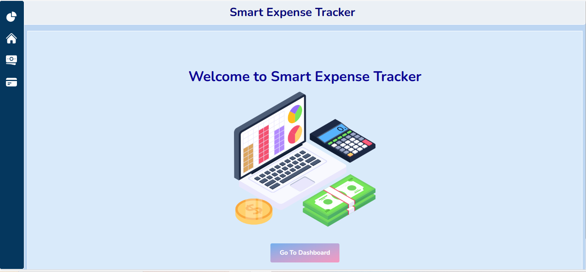

# 📊 Smart Expense Tracker (Full-Stack)

A simple, clean web application to **track income, expenses, balance, and spending categories** — built with **ReactJS, Tailwind CSS** (frontend) and **Node.js, Express, MongoDB Atlas** (backend). Visualize spending with **charts** and see where your money goes.

🌐 **Live App:** https://smart-expense-tracker-nine.vercel.app  
⚙️ **API (Backend):** https://smart-expense-backend-n1u3.onrender.com  

---

## ✨ Features

- ✏ Add & edit **incomes** and **expenses**
- 🧪 Filter expenses by **date, amount,** and **category**
- 📃 View **totals** and **category-wise** breakdown
- 📈 Visual **Pie Chart** for Spending Breakdown
- 🗂 **Summary Cards**: Income, Expense, Balance
- 🧾 View All Transactions in One Place
- 🎨 Clean, responsive dashboard for desktop & mobile
- 🌍 **Persistent storage with MongoDB Atlas**
- 🔄 **REST API (CRUD)** built with Express
- 📆 **Datepicker** for customizable date input
- 🔔 Notifications with **react-toastify**

---

## ⚙️ Tech Stack

### Frontend
- ⚛ ReactJS + Context API
- 🎨 Tailwind CSS
- 🔹 Heroicons
- 🧿 Recharts (charts & data viz)
- 🌌 Lottie animations
- 🚀 Deployed on **Vercel**

### Backend
- 🟢 Node.js + Express
- 🍃 MongoDB Atlas + Mongoose
- 🔑 CORS, dotenv, morgan
- 🚀 Deployed on **Render**

---

## 📂 Project Structure (Frontend)

📦 SmartExpenseTracker  
 ┣ 📂 src  
 ┃ ┣ 📂 components  
 ┃ ┃ ┣ Home.jsx  
 ┃ ┃ ┣ SummaryCards.jsx  
 ┃ ┃ ┣ ExpenseChart.jsx  
 ┃ ┃ ┣ Transactions.jsx  
 ┃ ┃ ┣ CategoryTotals.jsx  
 ┃ ┃ ┣ AddIncomeForm.jsx  
 ┃ ┃ ┣ IncomeList.jsx  
 ┃ ┃ ┣ AddExpenseForm.jsx  
 ┃ ┃ ┣ ExpenseList.jsx  
 ┃ ┃ ┣ FilterPanel.jsx  
 ┃ ┃ ┣ MobileViewHomePage.jsx  
 ┃ ┣ 📂 context  
 ┃ ┃ ┗ ExpenseContext.jsx  
 ┃ ┣ 📂 services  
 ┃ ┃ ┗ api.js  
 ┃ ┣ App.jsx  
 ┃ ┣ index.css  
 ┃ ┣ main.jsx  

---

## ❓ Why This Project?

✅ Demonstrates **React state management** (Context API), conditional rendering, and responsive design.  
✅ Showcases **full-stack development** with REST API + database.  
✅ Clean and clear **component-based architecture**.  
✅ Perfect **portfolio project** to showcase front-end + back-end integration.  

---

## 🤝 What I Learned

- Managing **global state** with React Context
- Building **REST APIs** with Express & MongoDB
- Handling **CRUD operations** from frontend to backend
- Deploying frontend (Vercel) and backend (Render) with environment variables
- Implementing **filters, charts, and responsive UI**

---

## 📸 Preview



---

## 🚀 Run Locally

### Backend
```bash
git clone https://github.com/<you>/smart-expense-backend
cd smart-expense-backend
npm install
npm run dev
```
---
